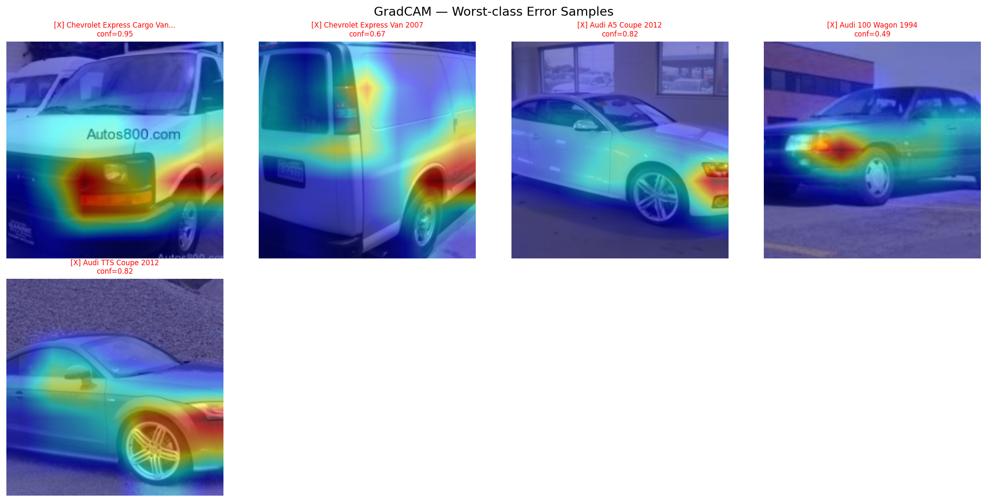

# Transfer Learning: ResNet-50 on Stanford Cars

Fine-tune an ImageNet-pretrained ResNet-50 on [Stanford Cars](https://ai.stanford.edu/~jkrause/cars/car_dataset.html) (196 car classes). Achieves **91.78% test accuracy**, surpassing the published baseline (~90%).

## Results

| Config | Test Acc | TTA | Training Time |
|--------|----------|-----|---------------|
| 224px, batch=128, lr=0.1 | 89.38% | 90.32% | 18.9 min |
| **448px, batch=64, lr=0.05** | **91.78%** | **91.93%** | **50.3 min** |

### GradCAM Visualizations

**Random test samples** -- the model focuses on car body shapes, grilles, and taillights for classification:


**Worst-class error samples** -- on difficult cases, attention is often diffuse or on irrelevant regions (background, watermarks):



### Most Confused Pairs

The top errors are between visually near-identical cars (same model different year/trim, or rebadged vehicles):

| True Class | Predicted As | Errors |
|-----------|-------------|--------|
| Audi S5 Coupe 2012 | Audi A5 Coupe 2012 | 14 |
| Audi TTS Coupe 2012 | Audi TT Hatchback 2011 | 13 |
| Audi TT Hatchback 2011 | Audi TTS Coupe 2012 | 12 |
| Dodge Caliber Wagon 2007 | Dodge Caliber Wagon 2012 | 12 |
| Dodge Sprinter Cargo Van 2009 | Mercedes-Benz Sprinter Van 2012 | 12 |

## Training Configuration (Best: 448px)

```
Model:      ResNet-50 (ImageNet V2 pretrained)
Resolution: 448x448 (--resolution 448)
Optimizer:  SGD (lr=0.05, momentum=0.9, weight_decay=1e-4)
Scheduler:  Step decay /10 every 30 epochs
Augment:    RandomResizedCrop(448) + RandomHorizontalFlip
Batch size: 64
Epochs:     90
Speedups:   AMP + torch.compile + channels_last
GPU Memory: ~14 GB / 16 GB (RTX 5080)
```

The lr is scaled from the 224px baseline (0.1) by the linear scaling rule: `lr = 0.1 * (64/128) = 0.05`.

## Experiment Log

8 runs total. Runs 1-6 failed (41-52%) due to lr too low, frozen backbone, and over-regularization. Run 7 followed an open-source baseline and succeeded. Run 8 pushed further with 448px resolution.

| Run | Strategy | lr | Resolution | Test Acc |
|-----|----------|----|-----------|----------|
| 1 | 2-stage AdamW | bb:1e-4 fc:1e-3 | 224 | 50.8% |
| 2 | 2-stage AdamW | bb:1e-4 fc:1e-3 | 224 | 52.2% |
| 3 | 2-stage AdamW | bb:1e-3 fc:1e-2 | 448 | 49.7% |
| 4 | 2-stage AdamW | bb:3e-4 fc:3e-3 | 448 | 50.3% |
| 5 | 2-stage SGD | bb:1e-3 fc:1e-2 | 224 | 51.4% |
| 6 | 2-stage SGD | bb:5e-4 fc:5e-3 | 448 | 41.2% |
| 7 | 1-stage SGD | 0.1 unified | 224 | 89.38% |
| **8** | **1-stage SGD** | **0.05 unified** | **448** | **91.78%** |

## Lessons Learned

1. **Learning rate is king** -- baseline uses lr=0.1; our failed runs maxed at 0.01 (10x too low). Fine-tuning needs aggressive lr to adapt backbone features from coarse ImageNet classes to fine-grained car models.

2. **Don't freeze the backbone** -- single-stage full-parameter training with a unified lr outperforms 2-stage frozen+unfrozen approaches. SGD gradients naturally scale per-layer updates.

3. **Higher resolution helps, but only with correct lr** -- Run 6 used 448px with lr=5e-4 and got 41%. Run 8 used 448px with lr=0.05 and got 91.78%. The resolution wasn't the problem -- the lr was.

4. **Batch size and lr are coupled** -- batch=128 + lr=0.1 is a validated combo. Small batches need proportionally lower lr.

5. **Reproduce the baseline first** -- don't try "advanced" techniques before confirming the simplest approach works.

## Usage

### Training

```bash
# 448px (best accuracy)
python train.py --resolution 448 --batch-size 64 --lr 0.05

# 224px (faster, baseline)
python train.py --resolution 224 --batch-size 128 --lr 0.1
```

Saves `best_model.pth` (best test accuracy checkpoint).

### Evaluation + Analysis

```bash
pip install grad-cam matplotlib  # one-time

python eval.py --resolution 448                # match training resolution
python eval.py --resolution 448 --tta          # test-time augmentation (6 views)
python eval.py --num-gradcam 32                # more GradCAM samples
python eval.py --checkpoint my_model.pth       # custom checkpoint
```

Outputs:
- Per-class accuracy with class names
- Top-10 most confused class pairs
- `gradcam_samples.png` -- GradCAM on random test samples
- `gradcam_worst.png` -- GradCAM on misclassified samples from worst classes
- With `--tta`: accuracy boost via 3-scale x 2-flip averaging (+0.15% at 448px, +0.95% at 224px)

## Dataset

[Stanford Cars](https://huggingface.co/datasets/tanganke/stanford_cars) via HuggingFace Datasets:
- 196 classes (make + model + year, e.g. "BMW M3 Coupe 2012")
- 8,144 train / 8,041 test images

## Dependencies

- Python 3.11
- PyTorch 2.10, torchvision 0.25
- `datasets` (HuggingFace)
- `grad-cam`, `matplotlib` (for eval.py)
